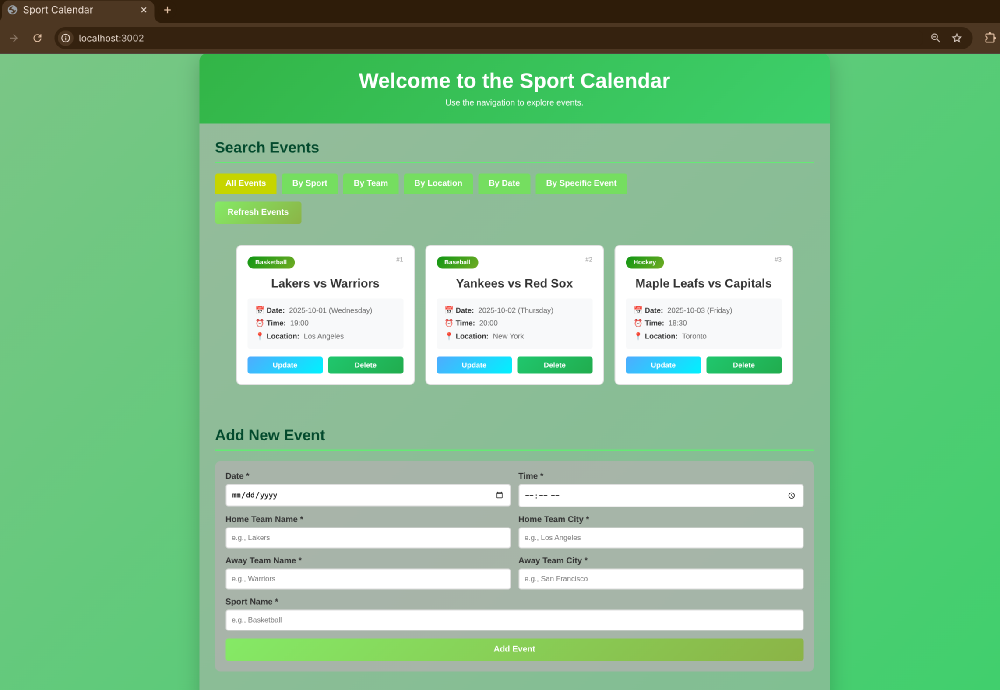
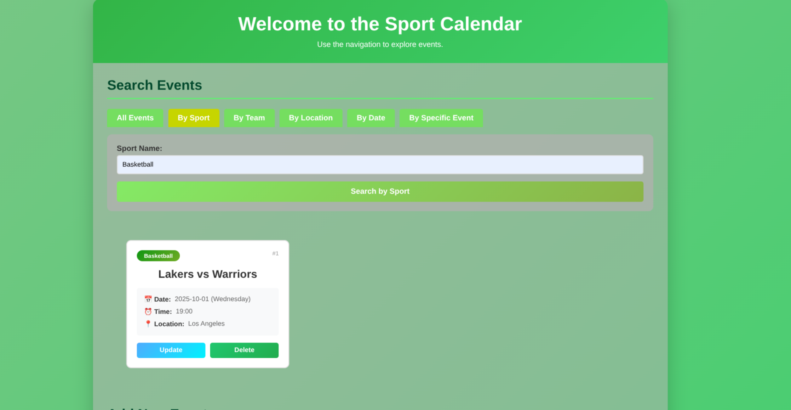
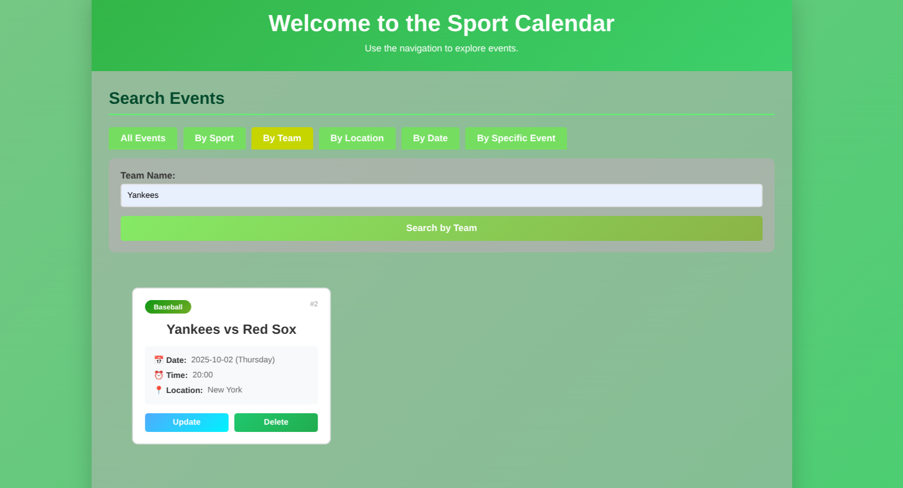
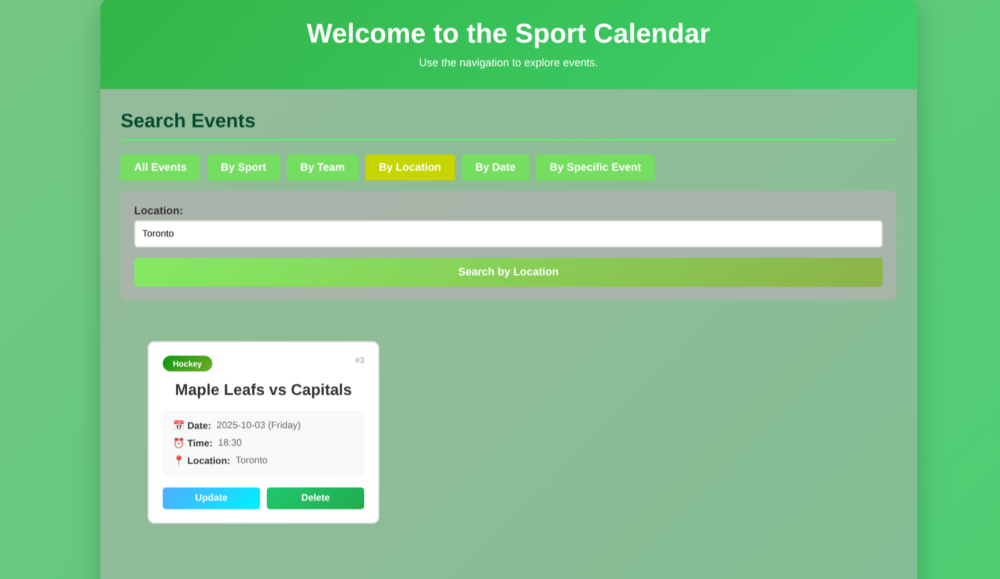
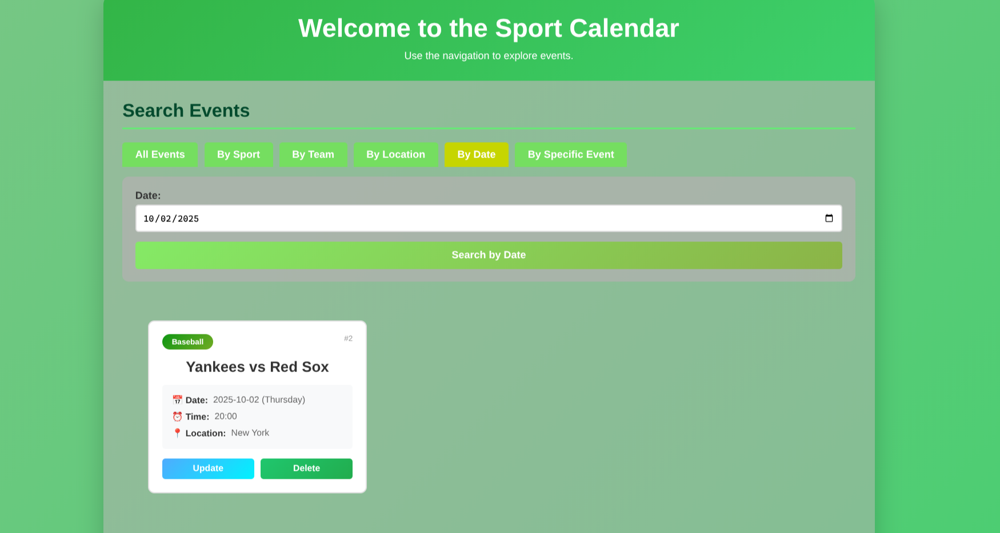
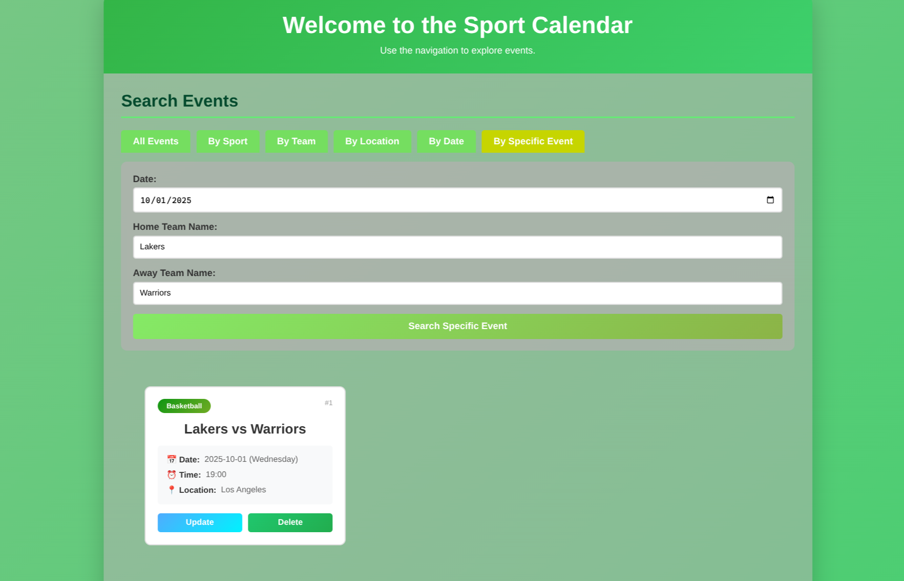
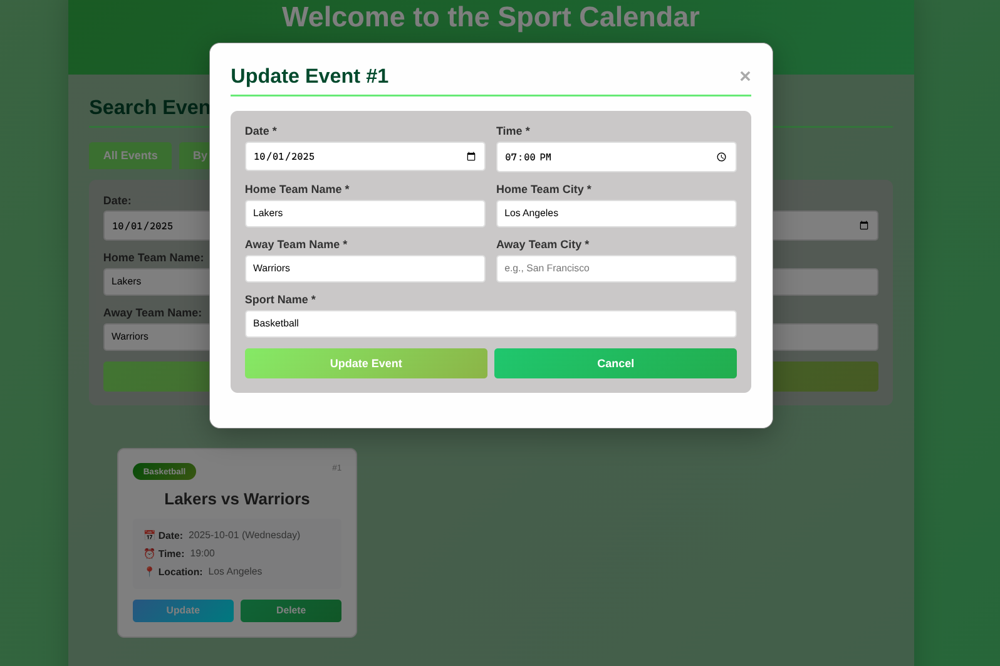
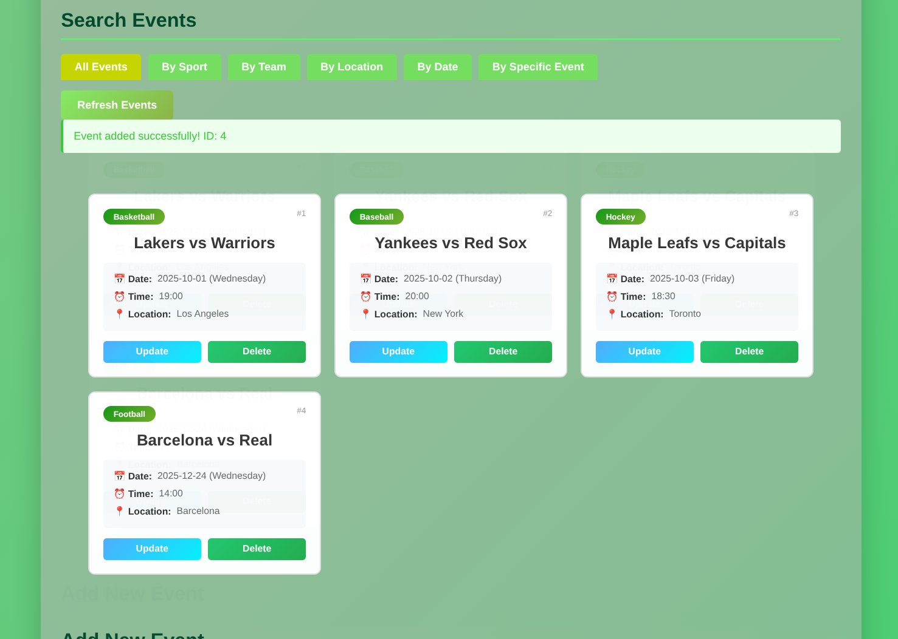
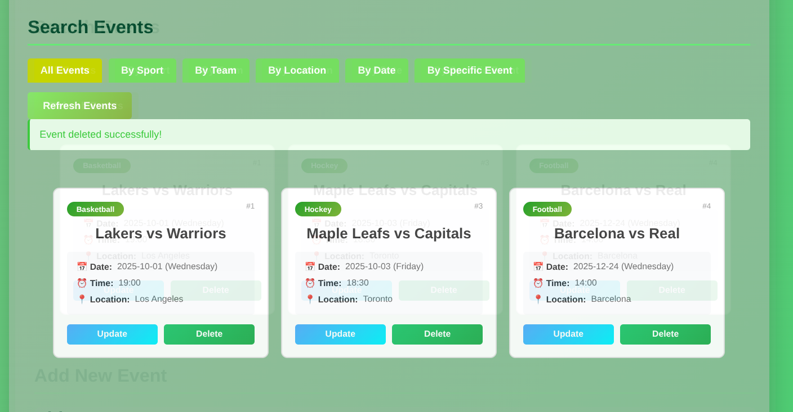

# Sport Calendar

## Overview

**This project is an example for a backend service of a Sport Calendar WebApp.**

**Database structure:**
- *Database consists of 3 tables:*
    - *Teams:*
        - **team_id**
        - team_name
        - team_city
    - *Sports:*
        - **sport_id**
        - sport_name
    - *Events:*
        - **event_id**
        - event_time
        - event_date
        - *_home_team_id*
        - *_away_team_id*
        - *_sport_id*

- *Server uses SQLite Database and `sqlite3` package for operations with the DB.*

- *Basic ER Diagramm showing the DB structure:*
    - 

**Server:**
- *Server is created using `Fastify` and `NodeJS` with TypeScript as it's main language.*
- *Server starts by creating/connecting to SQLite Database and filling it with example values, if it's empty. (/src/database.ts)*
- *Server modules structure:*
```
main.ts
  ├── config.ts
  ├── database.ts
  ├── routes/
  │   ├── index.ts (main router)
  │   ├── check.ts (health endpoints)   
  │   ├── events.ts
  │   │   ├── handlers/events.ts
  │   │   └── utils/events.ts
  │   ├── sports.ts
  │   │   └── handlers/sports.ts
  │   └── teams.ts
  │       └── handlers/teams.ts
  └── Fastify plugins
      ├── @fastify/cors
      └── @fastify/static
```

- *Server Endpoints:*
    - Read [API_info.md](API_info.md).

**Client Side:**
- *Server serves static HTML pages using `@fastify/static` plugin from `/public` directory.*
- *Frontend structure:*
    - `index.html` - Main page with search tabs and event display
    - `script.js` - API integration and event handlers (CRUD operations)
    - `styles.css` - UI styling with modal dialogs
- *Features:*
    - Search events by sport, team, location, date, or specific criteria
    - Create, update, and delete events
    - Responsive event cards with modal-based editing

## Setup

**In order to start the server you will need to:**
1. **Clone this repository to your machine.**
2. **Choose how you want to run the server:**
    - *through DevContainer in VSCode:*
        - make sure you have `Dev Containers` and `Docker` extensions installed.
        - `ctrl+shift+p` and start typing `Dev Containers: Reopen in Container`
        - after connecting to Container open a terminal and just run the command `npm run dev`.
        - You can connect to a server via the browser at `http://localhost:3002`
    - *through a Docker Container:*
        - make sure you have `Docker` and `Make` installed on your machine.
        - if you don't want to install `Make`, you can run the container by running `docker compose up -d` and stop it by running `docker compose down -v`.
        - `Make` makes it way easier for you to run and stop the server. Just run `make help` to see all available commands. Running the server requires only `make up`. Stopping can be done either with `make down` or `make clean`.
        - You can connect to a server via the browser at `http://localhost:3002`
    - *if you have npm installed:*
        - just run `npm run dev` in your terminal and connect to a server at `http:/localhost:3002`

3. Optional:
    - if you want to run tests, you need to use a DevContainers or have npm installed.
    - you can run tests just by running `npm test`.

## Assumptions and Decisions made

1. Whether to use 3NF or not: *I wanted to have sport_id also be a foreign key for Teams table, but I decided not to, because I will not display Team Information to a Client.*

2. Which DB to use: *I already had experience with SQLite and decided to check which DB plugins are also supported by fastify. Being short on time I decided to continue with SQLite.*

3. Which Language and Framework to use: *I work on my university and school projects at the same time, so I decided to use the most recent techstack I picked and most familiar with: Fastify and NodeJS with TypeScript.*

4. How to structure the API: *I was not quite sure as to which endpoints will be the most useful for this project, so I made a decision to go with my instincts. At the end of the day I have some endpoints that are not used. If I had more time, I would probably plan it better.*

5. How to create a frontend part: *Due to having not much experience with html and css, I tried using online tools to create an HTML page and later write my own script to it. Sadly the solutions I found were behind a paywall, so I decided to try generating a simple HTML page using copilot. After playing around with styles and fixing the script I had a simple page to work with my server. I decided to serve a static HTML page using @fastify/static to provide a simple UI without requiring a separate frontend server.*

6. How to make it easier for a user to run the server: *This is always a challenge for anyone to run something from a github. So I did my best to figure out the easiest way to run the application.*

## Client side

### Main page


### Search by Sport


### Search by Team


### Search by Location


### Search by Date


### Search for Specific Event


### Update Event Form


### New Event Added


### Event Deleted
